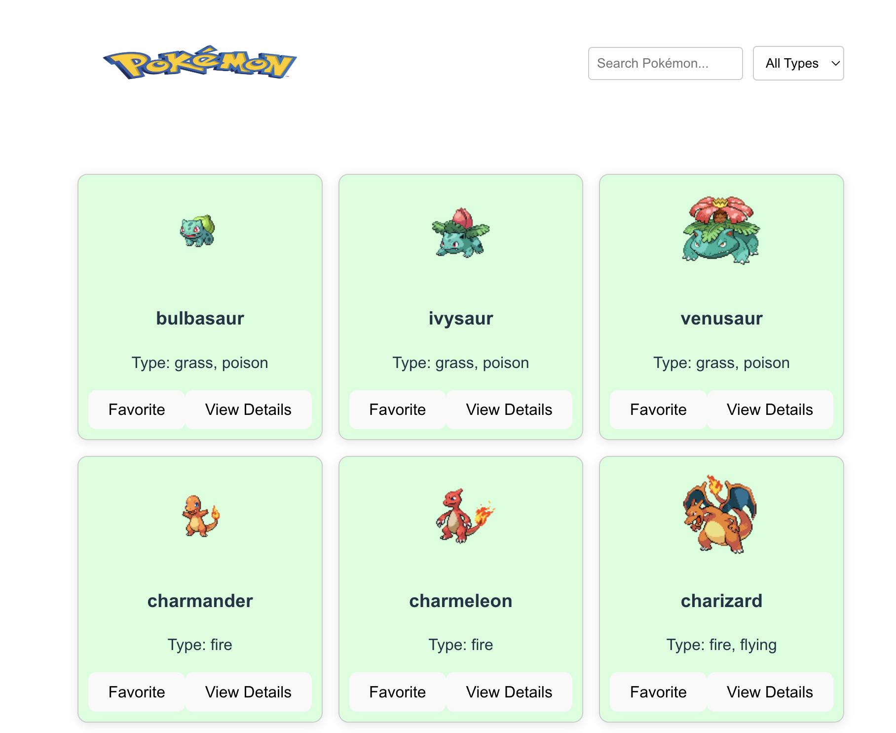
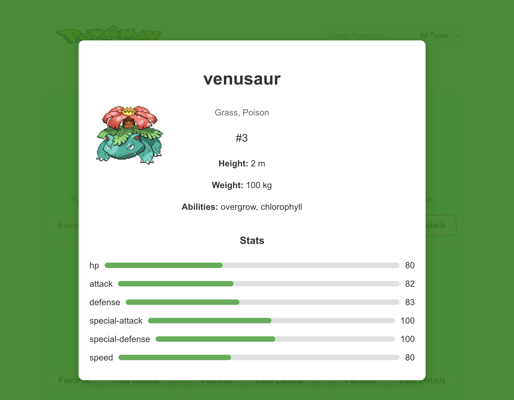

<!DOCTYPE html>
<html lang="en">
<head>
  <meta charset="UTF-8">
  <meta name="viewport" content="width=device-width, initial-scale=1.0">
 
</head>
<body>
  <h1 align="center">Pokemon</h1>

  

    A lightweight and interactive web application to explore Pokémon details, built using modern web technologies.
  

  <h2>Table of Contents</h2>
  <ul>
    <li><a href="#features">Features</a></li>
    <li><a href="#preview">Preview</a></li>
    <li><a href="#getting-started">Getting Started</a></li>
    <li><a href="#usage">Usage</a></li>
    <li><a href="#technologies-used">Technologies Used</a></li>
    <li><a href="#directory-structure">Directory Structure</a></li>
    <li><a href="#deployment">Deployment</a></li>
    <li><a href="#contributing">Contributing</a></li>
    
  </ul>

  <h2 id="features">Features</h2>
  <ul>
    <li>Search and view details of Pokémon including stats, abilities, height, and weight.</li>
    <li>Responsive design for seamless experience across devices.</li>
    <li>Dynamic stat bars and clean UI for an engaging user experience.</li>
    <li>Built using <b>JavaScript</b>/<b>TypeScript</b> with frameworks like <b>ReactJS</b> or <b>NextJS</b>.</li>
    <li>Optimized for performance and scalability.</li>
  </ul>

  <h2 id="preview">Preview</h2>
  

    
    
  

  <h2 id="getting-started">Getting Started</h2>
  <h3>Prerequisites</h3>
  <ul>
    <li>Node.js (latest stable version).</li>
    <li>A package manager like npm or yarn.</li>
    <li>Basic knowledge of JavaScript/TypeScript.</li>
  </ul>

  <h3>Installation</h3>
  <ol>
    <li>Clone the repository:</li>
    <pre><code>git clone https://github.com/your-username/pokedex-lite.git</code></pre>
    <li>Navigate to the project directory:</li>
    <pre><code>cd pokedex-lite</code></pre>
    <li>Install dependencies:</li>
    <pre><code>npm install</code></pre>
    <li>Start the development server:</li>
    <pre><code>npm start</code></pre>
    <li>Open your browser and visit:</li>
    <pre><code>http://localhost:3000</code></pre>
  </ol>

  <h2 id="usage">Usage</h2>
  <ol>
    <li>Search for Pokémon by their name or ID in the search bar.</li>
    <li>Click on any Pokémon card to view detailed stats and abilities.</li>
    <li>Enjoy exploring the world of Pokémon!</li>
  </ol>

  <h2 id="technologies-used">Technologies Used</h2>
  <ul>
    <li><b>Frontend:</b> ReactJS or NextJS</li>
    <li><b>Styling:</b> CSS Modules, TailwindCSS, or Styled-Components</li>
    <li><b>API:</b> Pokémon REST API</li>
    <li><b>Tooling:</b> Webpack, Babel</li>
    <li><b>Version Control:</b> Git</li>
  </ul>

  <h2 id="directory-structure">Directory Structure</h2>
  <pre><code>
  /src
    /components  - Reusable UI components
    /pages       - Application pages
    /services    - API service handlers
    /styles      - CSS or SCSS files
    index.js     - Application entry point
  </code></pre>

  <h2 id="deployment">Deployment</h2>
  
Follow these steps to deploy Pokedex Lite:

  <ol>
    <li>Build the production-ready version:</li>
    <pre><code>npm run build</code></pre>
    <li>Deploy the <code>build</code> folder to your hosting platform (e.g., Netlify, Vercel, GitHub Pages).</li>
  </ol>

  <h2 id="contributing">Contributing</h2>
  
We welcome contributions to make this project better. Follow these steps:

  <ol>
    <li>Fork the repository.</li>
    <li>Create a new branch: <code>git checkout -b feature/your-feature-name</code></li>
    <li>Make your changes and test thoroughly.</li>
    <li>Commit your changes: <code>git commit -m "Add your feature"</code></li>
    <li>Push to the branch: <code>git push origin feature/your-feature-name</code></li>
    <li>Open a pull request explaining your changes.</li>
  </ol>

</body>
</html>
